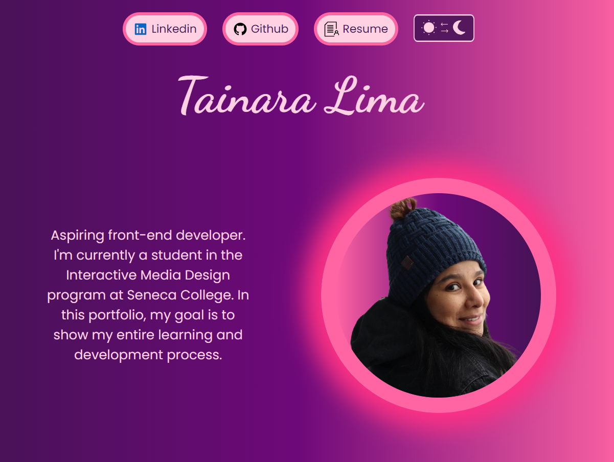

# Tainara Lima - Portfolio

This project is a website where I list all the projects I've created using the concepts I learned in the Introduction to Adaptive Web Development course under the guidance of Prof. Simul Bista.

To have a look at the webpage, click the banner below!

## Concepts used in this project

### HTML

- Semantic tags
- Links
- Images
- Title and external fonts
- SVG

### CSS

- Styling
- Animations
- Responsiveness
- Positioning

### Javascript

- Variables
- Getting HTML elements and manipulating with event listeners

### Git + Github

- Using Github pages to serve this and the other projects
- Using repositories to save and make updates

## Sources

- Footer background: [Haikei](https://haikei.app/)
- Fonts: [Dancing Script](https://fonts.google.com/specimen/Dancing+Script), [Poppins](https://fonts.google.com/specimen/Poppins)
- Generate gradients: [CSS Gradient](https://cssgradient.io/)
- Generate box-shadow: [CSS matic](https://www.cssmatic.com/box-shadow)
- SVG of the cats in the footer of page: [Freepik](https://www.freepik.com/)
- SVG online editor: [Boxy SVG](https://boxy-svg.com/)
- SVG icons: [SVG Repo](https://www.svgrepo.com/vectors/resume/)
- SVG for dark/light button made by me! xD
